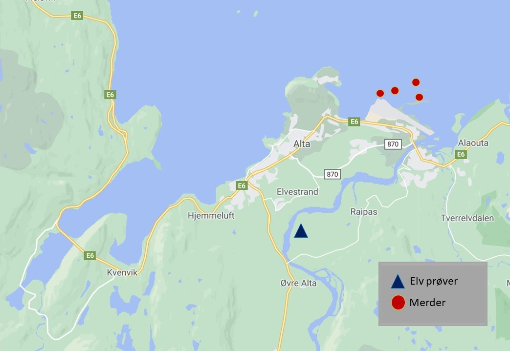

# Case Oppgave i Populasjonsbiologi (Populasjonsgenetikk)

<br/>

## **Innholdsfortegnelse:**

* [Introduksjon](#introduksjon)
* [Case Oppgave](#case-oppgave)
* [Referanse data](#referanse-data)
* [Populasjons data](#populasjons-data)
* [Instruks til python script](#instruks-til-python-script)
* [Sammendrag](#sammendrag)

## Introduksjon

Populasjonsgenetikk kan brukes til å identifisere blant annet populasjoner, naturlig seleksjon, slektskap mellom individider, populasjonsstørrelser over tid og hybridisering. 

Hybridisering i naturen er når to forskjellige arter eller populasjoner får avkom sammen. Dette individet vil være en blanding, og vil derfor ha arvemateriale (DNA) fra de to foreldreartene (eller foreldrepopulasjonene). 

Dette kan både ha negative og positive effekter for individet og populasjonene individene befinner seg i. Et vanlig eksempel på hybridisering er når en hest og et esel får avkom. Hybriden av de to artene vil mest sannsynlig ikke være forplantingsdyktig. Når to forskjellige populasjoner hybridiserer, vil ofte hybridene være forplantingsdyktige fordi to populasjoner er i utgangspunktet ikke like genetisk forskjellige som to arter. Dette kan føre til at populasjoner kan ha ha genflyt mellom seg. 

I noen tilfeller kan genflyt være negativt. Et mulig tilfelle der genflyt kan være et problem er når oppdrettslaks hybridiserer med villaks. Noen gange rømmer oppdrettslaks og hybridiserer med villaks. I dag skal vi bruke populasjonsgenetikk til å finne ut om oppdrettslaks har rømt fra merdene sine og hybridisert med villaks i elven avbildet i figur 1.


<br/>


**Figur 1:** Kart som viser oss hvor vi har tatt lakseprøver. Røde prikker viser oss lokale laksemerder. Blå trekant viser oss hvor vi har tatt lakseprøver. 


<br/>

## Case Oppgave

Dere har fått utdelt 3 referanse DNA sekvenser, en til oppdrettslaks, en til villlaks, og en til en hybrid laks. Dere har også fått utdelt DNA sekvenser til 20 laks fanget i elven på Figur 1. 

Oppgaven deres består i å finne en måte å skrive et python script som kan lese DNA sekvensene fra elven og identifisere om dette er en villlaks, oppdrettslaks eller hybrid.

<br/>

## Referanse data

Her er referanse sekvensene våre. Disse sekvensene (veldig liten del av DNA'et - arvematerialet) er unike for de ulike populasjonene våre. Her har vi faktisk bare to populasjoner, villlaks og oppdrettslaks. Vi har også en tredje type referanse sekvens, hybrid referansen, som er unik for hybrider.

Når vi får dna sekvenser fra et sekvenseringslaboratorium vil vi gjerne vite hvilket individ denne sekvensen kommer fra. En vanlig måte DNA data blir presentert på er ved at identifikasjonen til et individ kommer i første linje og starter alltid med symbolet ">", neste linje er deretter DNA strengen som tilhører individet. 

<br/>

<details>
<summary>Referanse data: (Klikk her)</summary>
<br>

    >Vill_laks_referanse
    ATCGGCAACGAATCACTACGGAAGCCGGACTACGAGCTACG
    >Oppdretts_laks_referanse
    ATCGGCAACGATCGACTACGGACTACGGACTACGAGCTACG
    >hybrid_ref
    ATCGGCAACGATCGACTACGGAAGCCGGACTACGAGCTACG"
    
</details>

<br/>


## Populasjons data

Her finner dere DNA sekvens dataen for 20 individer av laks vi har fisket fra elven i Figur 1.

<br/>

<details>
<summary>Populasjons data: (Klikk her)</summary>
<br>

    >Laks1
    ATCGGCAACGATCGACTACGGACTACGGACTACGAGCTACG
    >Laks2
    ATCGGCAACGATCGACTACGGACTACGGACTACGAGCTACG
    >Laks3
    ATCGGCAACGATCGACTACGGACTACGGACTACGAGCTACG
    >Laks4
    ATCGGCAACGATCGACTACGGACTACGGACTACGAGCTACG
    >Laks5
    ATCGGCAACGATCGACTACGGACTACGGACTACGAGCTACG
    >Laks6
    ATCGGCAACGATCGACTACGGACTACGGACTACGAGCTACG
    >Laks7
    ATCGGCAACGATCGACTACGGACTACGGACTACGAGCTACG
    >Laks8
    ATCGGCAACGAATCACTACGGAAGCCGGACTACGAGCTACG
    >Laks9
    ATCGGCAACGATCGACTACGGACTACGGACTACGAGCTACG
    >Laks10
    ATCGGCAACGATCGACTACGGACTACGGACTACGAGCTACG
    >Laks11
    ATCGGCAACGATCGACTACGGACTACGGACTACGAGCTACG
    >Laks12
    ATCGGCAACGATCGACTACGGACTACGGACTACGAGCTACG
    >Laks13
    ATCGGCAACGATCGACTACGGACTACGGACTACGAGCTACG
    >Laks14
    ATCGGCAACGATCGACTACGGACTACGGACTACGAGCTACG
    >Laks15
    ATCGGCAACGATCGACTACGGAAGCCGGACTACGAGCTACG
    >Laks16
    ATCGGCAACGATCGACTACGGAAGCCGGACTACGAGCTACG
    >Laks17
    ATCGGCAACGATCGACTACGGACTACGGACTACGAGCTACG
    >Laks18
    ATCGGCAACGATCGACTACGGAAGCCGGACTACGAGCTACG
    >Laks19
    ATCGGCAACGATCGACTACGGACTACGGACTACGAGCTACG
    >Laks20
    ATCGGCAACGATCGACTACGGAAGCCGGACTACGAGCTACG

</details>

<br/>

## Instruks til python script

<br/>

1. Først må vi kunne lese inn populasjons dataen vi har fått. Dere kan laste ned dataen fra denne siden, den heter populasjons_data.txt. Husk å plassere den i samme mappe som python scriptet deres.

    ```python
    data=open("populasjons_data.txt")
    ```

2. Nå som vi har lest inn dataen kan vi prøve å se hvordan den ser ut.

    ```python
    for i in les_data:
        print(les_data)
    ```
    Dette var ikke veldig leslig. Å lese inn tekst dokumenter kan være litt vanskelig hvis man ikke har gjort det før. Derfor har jeg lagt ved koden under:

    ```python
    # Les in data
    data=open("populasjons_data.txt")

    # Leser hver linje i dokumentet
    linjer=data.readlines()

    # Tom liste med individ navn
    individ=[]
    # Tom liste med sekvens navn
    sekvens=[]

    for linje in linjer:
        # Fjerner alle tomme linjer "\n" (\n betyr ny linje)
        linje=linje.strip("\n")
        # Siden vi ved identifikasjon begynner med ">",
        # kan vi bruke det til å hente navn på individene
        if linje.startswith(">"):
            individ.append(linje)
            sekvens.append("")
        else:
            #Her henter vi DNA sekvensene
            sekvens[-1]+=linje

    # Hent identifikasjon
    for i in individ:
        print(i) 
    # Hent Sekvens
    for i in sekvens:
        print(i)
    ```

3. Supert! Nå har vi identifikasjon og tilhørende sekvens i hver sin liste. Nå kan vi sammeligne referanse sekvensene med populasjons dataen vår for å se om vi har fanget noen hybrider eller oppdrettslaks som har rømt fra merdene.

    ```python
    # Definer referanse sekvensene
    oppdrettslaks_ref="ATCGGCAACGAATCACTACGGAAGCCGGACTACGAGCTACG"
    vill_laks_ref="ATCGGCAACGATCGACTACGGACTACGGACTACGAGCTACG"
    hybrid_ref="ATCGGCAACGATCGACTACGGAAGCCGGACTACGAGCTACG"

    # start en teller
    teller_oppdrettslaks = 0
    teller_villlaks = 0
    teller_hybrid = 0

    # For hver match til en DNA sekvens, legg til 1
    for i in sekvens:
        if sekvens == vill_laks_ref:
            teller_villlaks += 1
        elif sekvens == oppdrettslaks_ref:
            teller_oppdrettslaks += 1
        elif sekvens == hybrid_ref:
            teller_hybrid +=1

    # Gi oss resultatet
    print("I elven har vi identifisert: " + str(teller_villlaks) + " villlaks, " + str(teller_oppdrettslaks) +,  " oppdrettslaks, og " + str(teller_hybrid) + " hybrider.")


    ```

4. Greier du å kombinere alt til en funksjon?

<details>
<summary>Løsning: (Klikk her)</summary>
<br>


```python
def identifiser_fisk(data):
    
    # referanse data
    oppdrettslaks_ref="ATCGGCAACGAATCACTACGGAAGCCGGACTACGAGCTACG"
    vill_laks_ref="ATCGGCAACGATCGACTACGGACTACGGACTACGAGCTACG"
    hybrid_ref="ATCGGCAACGATCGACTACGGAAGCCGGACTACGAGCTACG"

    # les in data
    data=open(data)

    # Leser hver linje i dokumentet
    linjer=data.readlines()

    # Tom liste med individ navn
    individ=[]
    # Tom liste med sekvens navn
    sekvens=[]

    for linje in linjer:
        # Fjerner alle tomme linjer "\n" (\n betyr ny linje)
        linje=linje.strip("\n")
        # Siden vi ved identifikasjon begynner med ">",
        # kan vi bruke det til å hente navn på individene
        if linje.startswith(">"):
            individ.append(linje)
            sekvens.append("")
        else:
        #   Her henter vi DNA sekvensene
            sekvens[-1]+=linje

    # start en teller
    teller_oppdrettslaks = 0
    teller_villlaks = 0
    teller_hybrid = 0
    # For hver match til en DNA sekvens, legg til 1
    for i in sekvens:
        if i == vill_laks_ref:
            teller_villlaks += 1
        elif i == oppdrettslaks_ref:
            teller_oppdrettslaks += 1
        else:
            teller_hybrid += 1
    # Gi oss resultatet
    return(print("I elven har vi identifisert: " + str(teller_villlaks) + " villlaks, " + str(teller_oppdrettslaks) +  " oppdrettslaks, og " + str(teller_hybrid) + "            hybrider."))

identifiser_fisk("populasjons_data.txt")
```
 
    
</details>

5. Hvis du har tid kan du sjekke om scriptet ditt også fungerer for en annen populasjonen vi har tatt prøver fra(populasjons_data_ekstra.txt)

## Sammendrag

DNA - arvemateriale vil være ulikt mellom individer, populasjoner og arter. Basert på denne informasjonen kan vi bruke matematikk og programmering (populasjonsgenetikk) for å identifisere ulike individer, populasjoner eller arter. I dette eksemplet ville vi finne ut om oppdrettslaks rømte fra merdene og hybridiserte med villlaks i området. Siden genflyt mellom disse to populasjonene kan ha negative konsekvenser for villlaks, er det veldig viktig å finne ut om hybridisering forekommer. Denne informasjonen kan brukes til å gi beskjed til fiskeoppdretterne at her må det mer sikkerhet til slik at oppdrettslaksen ikke rømmer.
